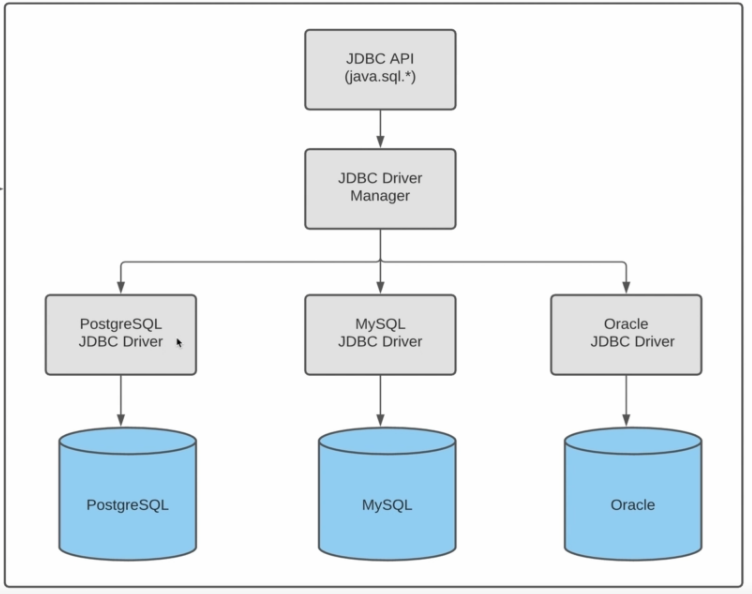

## Введение
Java является серверным языком программирования, следовательно нам часто нужно будет обращаться к БД. Для этого и существует модуль JDBC, по сути это стандарт. Представляет собой набор классов для отправки запросов в БД




## Подключение к БД

Для создания запросов к БД в классе Connection есть методы, связанные с Statement:

- Statement - используется для простых запросов без изменяемых параметров. Обычные DDL операции.
- CallableStatement - вызов хранимых процедур, мало распространено, так как сейчас принято логику размещать на уровне приложения.
- PrepareStatement - запросы с изменяемой частью, наследуется от Statement.

DriverManager.getConnection(url, username, password) внутри себя создаёт объект класса java.util.Properties и делигирует вызов в другой getConnection, который принимает Properties.

Properties - обычный класс основанный на старой реализации Hashmap - HashTable. Ассациативный массив: название свойства - значение.

Далее DriverManager.getConnection пытается из всех зарегистрированных драйверов найти тот, который подходит по url. По url getConnection не может определить какой драйвер подходит для конкретной СУБД, поэтому он проверяет все возможные драйверы.

Если подключиться с помощью очередного драйвера не удалось, то сохраняется exception, если удалось, то выходим из цикла с return connection, если нет, то пробрасывается SQLException.

Для подключения к БД можно создать утилитный класс.

Все **Утилитные классы** должны быть final и иметь private конструктор.

Чтобы не обрабатывать исключение внутри метода, можно бросать RuntimeException, чтобы программа падала в случае исключения.

```java
 try {
            return DriverManager.getConnection(URL,USERNAME,PASSWORD);
        } catch (SQLException e) {
            throw new RuntimeException(e);
        }
```

До Java 1.8 были проблемы с загрузкой драйверов (postgresql-42.5.4.jar) и они не находились в classpath. Их нужно было загружать дополнительно в статическом блоке инициализации:

```java
 static {
        try {
            Class.forName("org.postgresql.Driver");
        } catch (ClassNotFoundException e) {
            throw new RuntimeException(e);
        }
    }
```

Класс загружается в память JVM, после Java 1.8 этап память называется MetaSpace.

Статический блок отрабатывает ровно один раз при загрузке в MetaSpace.

## app;ication.properties

Ручное получение пропертей из файла

```java
public final class PropertiesUtil {
    private static void loadProperties() {
            try(InputStream inputStream =
                        PropertiesUtil.class.getClassLoader().getResourceAsStream("application.properties")) {
                PROPERTIES.load(inputStream);
            } catch (IOException e) {
                throw new RuntimeException(e);
            }
        }
    ...
}

public final class ConnectionManager {

    public static Connection open(){
            try {
                return DriverManager.getConnection(
                        PropertiesUtil.get(USERNAME_KEY),
                        PropertiesUtil.get(PASSWORD_KEY),
                        PropertiesUtil.get(URL_KEY)
                );
            } catch (SQLException e) {
                throw new RuntimeException(e);
            }
        }
}

```

## Statement DDL операции

В реальном проекте каждый раз не создаётся новое подключение, а переиспользуются существующие. Т.е. создаётся пул соединений. Создание соединения - дорогостоящая операция.

Для выполнения универсального запроса используется метод Statement.execute(String): boolean. 
Возвращает true - если select и данные вернулись. false - любой не select оператор или ddl.

Statement в основном используется для ddl операций.

Есть более информативные разновидности этого метода 
- Statement.executeUpdate(): int для методов INSERT/UPDATE 
- Statement.executeQuery(): ResultSet для SELECT

Statement.executeLargeUpdate(): long - обновляет большое число строк (больше 4 байт или 1 млрд. записей)

Statement.getUpDateCount() - возвращает количество обновлённых строк при вставке в БД.

В одном SQL-запросе можно передавать сразу несколько вставок, удалений, создания таблиц.

Statement.executeUpdate() - чаще встречается на практике, возвращает колличество вставленных, обновленных или удлённых строк.

```java
String updateSql = """
                UPDATE info
                SET date = 'TestTest'
                WHERE id = 5
                RETURNING *
                """;
```

RETERNING - возвращаем строки, которые обновили. По сути получаем ResultSet. Statement.executeUpdate() при этом вернёт ошибку, так как возвращается в него не int, а Statement.execute() вернёт true.

## Result set

\* лучше не использовать в запросе SELECT, а перечислять все колонки, которые нужно получить.

для SELECT запросов используется Statement.executeQuery(), который возвращает ResultSet

ResultSet нужно закрывать.

ResultSet похож на итератор, в его методе next() совмещены методы hasNext() и next() итератора.

bigint в postgres аналог long в Java.

Есть два варианта получить данные из ResultSet:
- ResultSet.getLong(номер колонки) при SELECT с * не стоит полагаться на порядок колонок.
- ResultSet.getLong(имя колонки) 

ResultSet так же позволяет делать INSERT и UPDATE операции.

ResultSet.updateLong(номер колонки/имя колонки, значение) - этот метод у ResultSet позволяет обновить строку в БД. По умолчанию работать не будет, т.к. ResultSet read-only. Данные параметры нужно менять при создании Statement.

## Прокручиваемый ResultSet

Начиная с версии JDBC 2.0 появилась возможность направленной прокрутки набора результата.
Для этого, при создании Statement необходимо указать параметр желаемой прокрутки.

```java
Connection conn = ConnectionPool.init().getConnection();
Statement stmt = conn.createStatement(ResultSet.TYPE_SCROLL_INSENSITIVE, ResultSet.CONCUR_READ_ONLY);
ResultSet rset = stmt.executeQuery("SELECT t.* FROM warehouses t");
...
rset.close();
stmt.close();
ConnectionPool.init().comebackConnection(conn);
```

- ResultSet.TYPE_FORWARD_ONLY: значение по умолчанию, прокрутка в одном направлении;
- ResultSet.TYPE_SCROLL_INSENSITIVE: прокрутка назад и вперед. При изменении данных в БД, ResultSet не отразит этого.
- ResultSet.TYPE_SCROLL_SENSITIVE: тоже самое что и 2, плюс отражает реальное представление данных в базе данных по мере их изменения.

Для перемещения курсора вперед, традиционно вызываем next(), для перемещения назад — previous(). Также можем вызвать first() или last() для перемещения в начало или конец курсора. Можно перейти на конкретную строку указав ее индекс — absolute(5) или переместиться относительно текущего на порядок — relative(3).

## Редактируемый ResultSet

Вместо создания привычных стейтментов для обновления (вставка, редактирование, удаление) мы можем воспользоваться ранее созданным ResultSet`ом. Но для этого во второй параметр метода по созданию Statement необходимо указать ResultSet.CONCUR_UPDATABLE.

В таком ResultSet вы сможете не только обновлять выбранные записи, но и создавать новые, а также производить удаление.

```java
Connection conn = ConnectionPool.init().getConnection();
Statement stmt = conn.createStatement(ResultSet.TYPE_SCROLL_INSENSITIVE, ResultSet.CONCUR_UPDATABLE);
ResultSet rset = stmt.executeQuery("SELECT t.* FROM warehouses t"); //Псевдоним тут не случайно

// Обновим строку
rset.absolute(5); //Переходим на 5 строку
rset.updateObject("active_date", new java.sql.Date(new Date().getTime())); //Устанавливаем значение в поле
rset.updateRow(); //Фиксируем данные

//Вставим новую строку
rset.moveToInsertRow(); //Добавляем новую строку и переходим на нее
rset.updateObject("id", 123);
rset.updateObject("name", "Склад №4");
rset.updateObject("active_date", new java.sql.Date(new Date().getTime()));
rset.insertRow();  //Фиксируем данные

//Удалим строку
rset.last(); // Идем на последнюю строку
rset.deleteRow(); // Удаляем ее из БД

rset.close();
stmt.close();
ConnectionPool.init().comebackConnection(conn);
```
Вызов метода cancelRowUpdates() отменит все ожидающие изменения.
Перед вызовом методов updateRow() или insertRow() необходимо проверять, что текущая строка находится в состоянии обновления или создания соответственно. Иначе возникнет исключение.

ResultSet - аналог курсора в БД, но на практике его лучше использовать только для получения данных.

ResultSet можно не закрывать, так как он будет автоматически закрыт, тогда когда будет закрыт Statement, который его создал.

## ResultSet. Generated keys

При вставке данных в таблицу бывает необходимо получить автоматически сгенерированные ключи строк в БД. Это можно сделать вызвав метод Statement.getGeneratedKeys().

При этом в методе Statement.executeUpdate(sql_querry, autoGeneratedKeys) нужно указать второй параметр - autoGeneratedKeys, это набор констант, который пошёл ещё с времени, когда в Java не было enum.

Два возможных варианта:
- Statement.RETURN_GENERATED_KEYS
- Statement.NO_GENERATED_KEYS

## SQL Injection

Если значение в поле может быть null, то его лучше получать через ResultSet.getObject("id", Long.class)

```java
public class SqlInjectionEx {
    public static void main(String[] args) throws SQLException {

        String sqlParametr = "2 OR 1 = 1; DROP TABLE info;";
        System.out.println(extracted(sqlParametr));
    }

    private static List<Long> extracted(String sqlParametr) throws SQLException {
        String sqlInj = """
                SELECT id FROM ticket
                WHERE flight_id = %s
                """.formatted(sqlParametr);

        List<Long> result = new ArrayList<>();

        try (Connection connection = ConnectionManager.open();
                Statement statement = connection.createStatement()) {
            ResultSet resultSet = statement.executeQuery(sqlInj);

            while (resultSet.next()) {
                result.add(resultSet.getObject("id", Long.class));
            }
        }
        return result;
    }
}
```
Через подобные вставки в текст sql-запроса можно внедрять вредоносный код и повредить БД.

Для того, чтобы обезопасить запросы нужно использовать PrepareStatement, который проверяет наличие sql Inоection и не допускает выполнение таких запросов.


